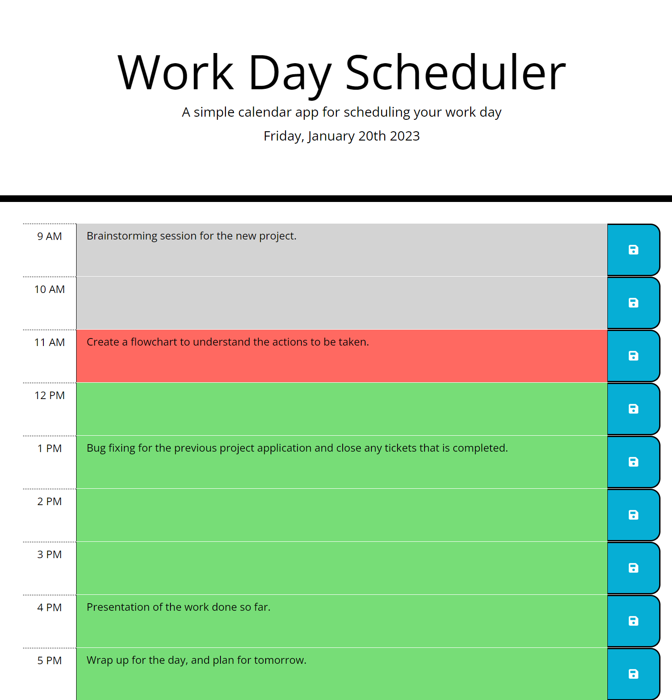

# Work Day Scheduler

## Description

This application can be used for scheduling and organizing tasks during the working hours of the current day. It can be useful for easy reference during different times of the day.

The following steps were taken while creating this application:

* The date displayed on top of the application uses moment object created with current date and time.

* Each time block displayed on the application, for every hour, uses bootstrap rows and columns classes in HTML.

* The background color of each time block is set accordingly by comparing the hour value of the block with the current hour.

* When a task is added, modified, or removed, the corresponding save button in the time block, saves the task and persists it using local storage for future reference.

* The application is displayed with all the tasks that is available from the local storage.

## Installation

The application can be accessed at the following website:

https://jayapk21.github.io/Work-Day-Scheduler/

## Usage

The following screenshot shows a sample of how the application can be used.

